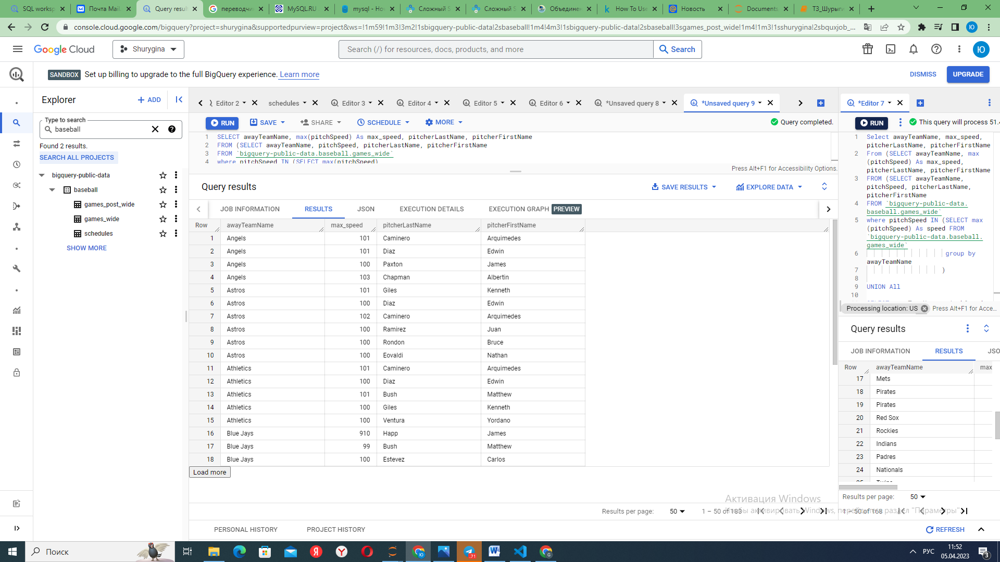
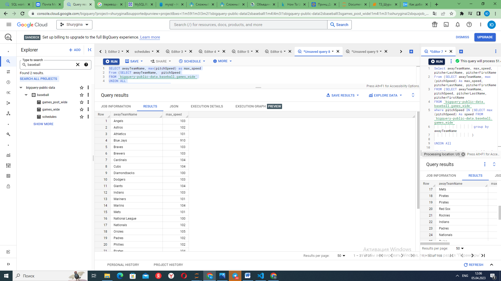

При выполнении этого задания возникли затруднения:
Не нашла в таблицах teamId(принадлежность игрока к определенной команде), делала по awayTeamName
Удалось получить Таблицу где для каждого питчера показана максимальная скорость удара за все сезоны, во время игры на выезде определенной команды.

`SELECT awayTeamName, max(pitchSpeed) As max_speed, pitcherLastName, pitcherFirstName
FROM (SELECT awayTeamName, pitchSpeed, pitcherLastName, pitcherFirstName
FROM `bigquery-public-data.baseball.games_wide`
where pitchSpeed IN (SELECT max(pitchSpeed)
                     FROM `bigquery-public-data.baseball.games_wide`
                     group by awayTeamName
                    )

UNION ALL
SELECT awayTeamName, pitchSpeed, pitcherLastName, pitcherFirstName
FROM `bigquery-public-data.baseball.games_post_wide`
where pitchSpeed IN (SELECT max(pitchSpeed) 
                     FROM `bigquery-public-data.baseball.games_post_wide`
                     group by awayTeamName
                    )) As subquery
group by awayTeamName, pitcherLastName, pitcherFirstName
order by awayTeamName
;`

Если не выводить имена: получаем максимальную скорость броска для каждой команды на выезде
`SELECT awayTeamName, max(pitchSpeed) as max_speed
From (SELECT awayTeamName,  pitchSpeed
FROM `bigquery-public-data.baseball.games_wide`
UNION ALL
SELECT awayTeamName,  pitchSpeed
FROM `bigquery-public-data.baseball.games_post_wide`)
group by awayTeamName
order by awayTeamName;
`

